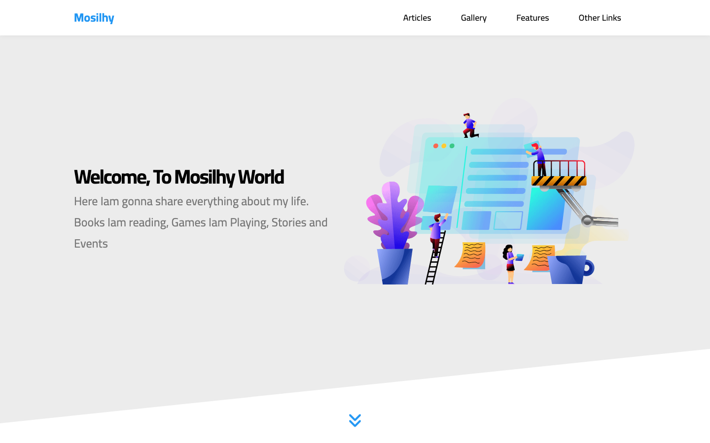

# Mosilhy Website

A large, responsive business-style landing page built with HTML and CSS. The project brings together many common marketing-site patterns in a single implementation, from articles and galleries to services, pricing, events, media, statistics, and lead generation.

[View the live demo](https://mohamedmosilhy.github.io/Mosilhy-website/) · [View the source](https://github.com/mohamedmosilhy/Mosilhy-website)



## Page sections

- Header navigation with a large mega menu
- Illustrated hero section
- Article-card collection
- Image gallery
- Quality, Time, and Passion feature cards
- Testimonials and team-member profiles
- Service catalogue
- Skill-level presentation
- Three-step work process
- Event countdown design and newsletter field
- Three-tier pricing plans
- Video playlist layout
- Statistics section
- Discount information and request form
- Multi-column footer

## Implementation highlights

- Extensive responsive coverage with desktop, tablet, and mobile breakpoints
- Reusable container, section-title, card, and grid patterns
- CSS Grid and Flexbox used throughout a long-form layout
- Mega-menu, hover states, overlays, progress bars, pricing ribbons, and decorative shapes
- Local images and Font Awesome assets
- CSS custom properties for shared colors and transitions

This is a static front-end implementation. Countdown values, video selection, subscriptions, and forms are visual examples and are not powered by JavaScript or a backend.

## Built with

- HTML5
- CSS3
- CSS Grid and Flexbox
- Responsive media queries
- Normalize.css
- Font Awesome
- Google Fonts

## Project structure

```text
Mosilhy-website/
├── css/
│   ├── normalize.css
│   ├── all.min.css
│   └── mosilhy.css
├── images/       # Content, backgrounds, avatars, and illustrations
├── webfonts/     # Local Font Awesome files
├── index.html
└── README.md
```

## Run locally

```bash
git clone https://github.com/mohamedmosilhy/Mosilhy-website.git
cd Mosilhy-website
```

Open `index.html` in a browser. No dependencies or build process are required.

## What this project demonstrates

- Organizing a complex page into maintainable visual sections
- Reusing CSS patterns across many different content types
- Handling dense content responsively without a framework
- Creating polished interaction states with CSS alone
